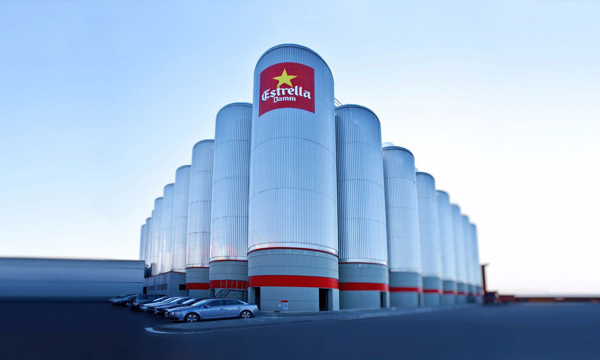
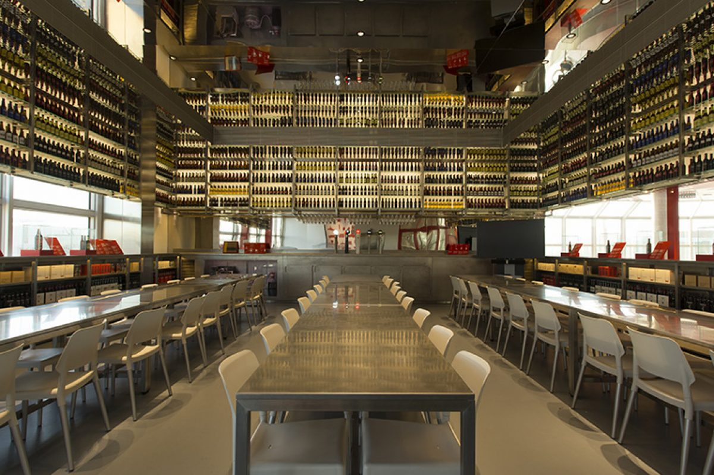
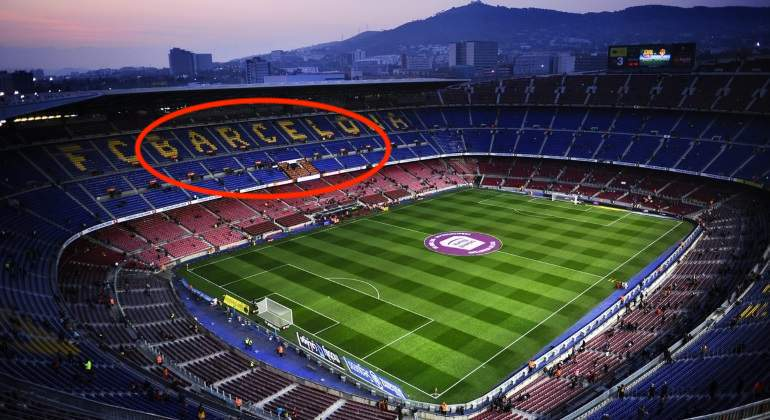
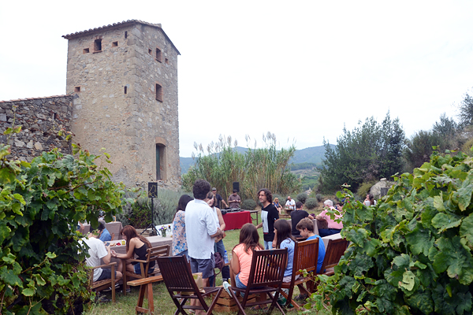

<script> 
    $(document).ready(function() { 
    $head = $('#header'); 
    $head.prepend('<A href = https://www.cuttingedge-events.com></A>') 
    }); 
</script> 


```{r setup, include=FALSE}
knitr::opts_chunk$set(echo = FALSE, message=FALSE, warning=FALSE)
```


```{r libraries}
library(readxl)
library(dplyr)
library(knitr)
library(timevis)

```

## ACCOMODATION

### _**Main Hotel: Catalonia Plaza Catalunya**_

<iframe src="Catalonia Plaza Catalunya/cataloniaplazacat.html" frameborder="0" width="100%" height="1100" scrolling="no"></iframe>

### **Alternative Hotels** {.tabset .tabset-fade .tabset-pills}

#### H10 Metropolitan


<iframe src="H10 Metropolitan/H10Metropolitan.html" frameborder="0" width="100%" height="1100" scrolling="no"></iframe>

<iframe width="100%" height="450" src="https://www.youtube.com/embed/KJthH7IU8Xo" frameborder="0" allow="accelerometer; autoplay; encrypted-media; gyroscope; picture-in-picture" allowfullscreen></iframe>

<br>

#### The Corner Hotel

<iframe src="The Corner/Corner.html" frameborder="0" width="100%" height="1100" scrolling="no"></iframe>

<iframe width="560" height="315" src="https://www.youtube.com/embed/MOn_FCFsdDQ" frameborder="0" allow="accelerometer; autoplay; encrypted-media; gyroscope; picture-in-picture" allowfullscreen></iframe>

<br>

## TIMELINE AND PROGRAM

<iframe src='https://cdn.knightlab.com/libs/timeline3/latest/embed/index.html?source=1rcztc7Z29TBIr4GOwhcV-_GUc11N35eoIjWkV2sUUXM&font=Default&lang=en&initial_zoom=2&height=500' width='100%' height='650' webkitallowfullscreen mozallowfullscreen allowfullscreen frameborder='0'></iframe>

### DAY 1 - May 16th, 2020

**Activity - Estrella Damm brewery** 

Calculating the arrival time by 15:00 - 16:00.
Cutting Edge Events staff will welcome the group at Barcelona airport and will scort the group to the first activity, a visit to the most well-known catalan beer, Estrella Damm factory. 
As the group will have a bus at disposal for the activity, guests will keep the luggage inside the bus trunk. 

Estrella Damm factory is just 10 minutes form Barcelona airport, and the visit will take about 1h30 - 2h. 

* **Location** El Prat del Llobregat
* **Duration** 2 hours aprox  
* **Capacity** Minimum 8pax - maximum 50pax 
* **Included** Bus, guided visit, beer tasting.

Once the activity has finished, guests will go directly to the hotel to check in.





***Dinner - Alba Granados***

The first dinner of the trip will be at Alba Granados. 
This restaurant is located in a walking distance from the hotel, as there are only 10 minutes by walking. 

<iframe src="Alba Granados/AlbaGranados.html" frameborder="0" width="100%" height="1100" scrolling="no"></iframe>

### DAY 2 - 17th May, 2020

During the second day in the morning the group will enjoy of their free time in Barcelona. Shopping, walking, visiting museums... Guests will have time till 13:00 to do whatever they want. 

**Lunch - Flamant**

Lunch time will be by 13:00.

<iframe src="Flamant/Flamant.html" frameborder="0" width="100%" height="1050" scrolling="no"></iframe>

**Activity - Barça's game**

Figuring out that the game starts at 18:00, we should leave the hotel by 16:30 aproximately, as it turns into a really busy zone when Barcça's games. If the lunch ends at 15:00 aprox, we will go first to the hotel for a quick fresh up or resting few minutes before gogin to the stadium. 
At 16:30 the bus will be waiting in font of the hotel to pick up the group and go directly to the stadium. 



*This will be the zone where guests will be located*


After the game, the bus will be waiting out of the stadium, just few meters away from the entrance door. A member of Cutting Edge Events will meet the group outside and will scrot thm from the stadium to the bus. 
As it will be late, we will go directly to the restaurant as it will be dinner time already (20:00 aproximately). Booking will be at 21:00 as it is really difficult leaving the stadium zone by bus (because of traffic)

**Dinner - Julivert Meu** 

The restaurant we suggest for dinner is Julivert Meu. Located also in a walking distance from the hotel, at Oldtown district of thte city, is only 5 minutes by walking.

<iframe src="JULIVERT MEU/Julivert.html" frameborder="0" width="100%" height="1100" scrolling="no"></iframe>

### DAY 3 - 18th May, 2020

**Activity - E-bike tour and Winery visit**

On the last day we suggest an e-bike tour along the coastline of barcelona finishing at Boquet D'Alella winery, a familiar winery located in Alella, small town 15km from Barcelona. Guests will bring their luggage to the bike shop, as they will bring it out to the winery later. Once they have finished with the activity, a bus will come to the winery to pick up the group and take them to the airport.

* **Location** Barcelona - Alella
* **Duration** 5 hours aprox  
* **Capacity** Minimum 8pax - maximum 50pax 
* **Included** E-bike tour, guided visit, wine tasting, lunch at winery and bus transfer to the airport .


<iframe src="https://uploads.knightlab.com/storymapjs/ee2f18a9c1765fc1a4086f419505950c/ebike-tour/index.html" frameborder="0" width="100%" height="800"></iframe>

When the group arrives to Alella, they will visit this small and familiar winery. They will enjoy of the views of Alella, which is a really small town but with a good living atmosphere. 
after the visit they will finish the acitvity having a picnic lunch outside (if weather allows us)!



Once they've finished the bus will pick them up and they will go to the airport for the flight departure.


*****

## Budget

<iframe src="https://czb20190024budget.netlify.com/"  frameborder="0" width="100%" height="1600" scrolling="no"></iframe>

<br>

## Terms & Conditions

  * Restaurant rates are valid for 2019, it is possible to suffer small changes.
  
  * Football and Bullfight dates are estimated, the final dates and hours will be published 15 days prior the event.
  
  * Rates valid for a group of 40 pax.
  
  * Cutting Edge Events management fee including in the detailed rates
  
  * VAT included. 
  
  * No reservation has been done. Availability upon request.

## Amaze your clients!!

<div class="client_offer">

<p>Didn't you just love our presentation ? Our first goal here at _**Cutting Edge Events**_ is to help you **win** this business. You will most likely now collate the information contained in this website and make your own presentation
to show your client<br>

<p>Why not leverage our technology, and present your client with the same format ? As a **totally free service**, we offer you the possibility of doing the work for you</p>

<p> We will: 
  <ul>
    * Follow your instructions to add anything you want to be in your presentation, and delete anything that you don't consider relevant
    * Include your logo and company details, and remove all our company details
    * We can even change some colors to mimic your corporate identity
    * We will send you the new link, and it will look as if it was your work
  </ul>
</p>
</div>

<style>

.client_offer{
background-color: #ee7600;
color: white;
padding: 10px;
border: 1px solid black;
margin-left: 25px;
margin-right: 25pax;
border-radius: 5px;
font-style: italic;
}
</style>

******************


